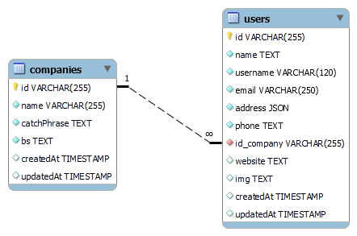

# BACK-END

>## Overview


This project is built with Node.js + Express.js + TypeScript.

To run the project you need to import the .sql into mysql and then run the following command in the main or root folder:

1. Server
```zsh
$ npm run start
```
2. Developer
```zsh
$ npm run start
```

## Database
---------------------------------------
The database used for this project is mysql, in which only two tables were created ("users" and "companies"), which have a one-to-many relationship, being the "companies" table the one that can have several users.



## Folder Architecture
---------------------------------------
```
📦src
 ┣ 📂assets
 ┣ 📂controllers
 ┣ 📂db
 ┣ 📂enum
 ┣ 📂helpers
 ┣ 📂interfaces
 ┣ 📂middlewares
 ┣ 📂models
 ┣ 📂routes
 ┣ 📂scripts
 ┗ 📜server.ts
```

## Routes
---------------------------------------
The available routes or endpoints are:

```
-> api/users
   ├─ GET
   │  └─ :id
   ├─ POST
   ├─ PUT
   │  └─ :id
   └─ DELETE
      └─ :id

-> api/companies
   ├─ GET
   │  └─ :id
   ├─ POST
   ├─ PUT
   │  └─ :id
   └─ DELETE
      └─ :id
```

## Commands
---------------------------------------
The commands available for the execution and management of the project are:

1. Compile in js all the files of the project saving them in the ./dist folder.
```zsh
$ npm run build
```

2. Run the project with ts-node once as server. 
```zsh
$ npm run start
```

3. Run the project with nodemon waiting for the changes to be updated. 
```zsh
$ npm run dev
```

4. Run the project in test mode.
```zsh
$ npm run test
```

## Libraries
---------------------------------------
The project has the following dependency libraries:

```
->  Dependencisas:
    ├─"cors": "^2.8.5",
    ├─"dotenv": "^16.0.3",
    ├─"express": "^4.18.2",
    ├─"express-validator": "^6.14.2",
    ├─"gravatar": "^1.8.2",
    ├─"md5": "^2.3.0",
    ├─"mysql2": "^2.3.3",
    ├─"sequelize": "^6.25.3",
    └─"sqlite3": "^5.1.2"
    
->  devDependencies
    ├─"@types/cors": "^2.8.12",
    ├─"@types/express": "^4.17.14",
    ├─"@types/gravatar": "^1.8.3",
    ├─"@types/md5": "^2.3.2",
    ├─"ts-node": "^10.9.1",
    └─"typescript": "^4.8.4"
```